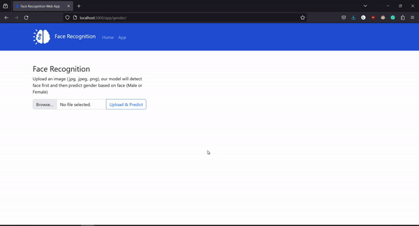

# face-recognition

## O Face Recognition App é um projeto que abrange dois módulos essenciais:

O Face Recognition App é um projeto que abrange dois módulos essenciais:

### 1. Treinamento do Modelo de Reconhecimento Facial:
O treinamento do modelo de reconhecimento facial consiste em cinco etapas:

* Coleta de Dados: Reunir dados relevantes para o treinamento.
* Pré-processamento de Dados: Preparar os dados para otimizar a qualidade.
* Engenharia de Atributos: Identificar e selecionar atributos significativos.
* Modelo de Aprendizado de Máquina: Desenvolver e treinar o modelo preditivo.
* Criar Pipeline de ML: Estabelecer uma sequência integrada para o fluxo de trabalho de machine learning.

### 2. Aplicação Web:
A aplicação web é composta por três etapas:

* Desenvolvimento da Aplicação Web: Utilização do Flask para a interconexão servidor web (backend). Implementação de HTML para a estrutura visual (frontend). Adoção do Bootstrap para a estilização (frontend).

* Integração do Modelo de Aprendizado de Máquina: Incorporação eficiente do modelo de reconhecimento facial.

* Implantação da Aplicação Web em um Serviço em Nuvem: Hospedagem da aplicação web para acessibilidade global.

## Como Usar:

Para utilizar o app basta entrar nesse [link](https://face-recognition-web-app-royh.onrender.com)

